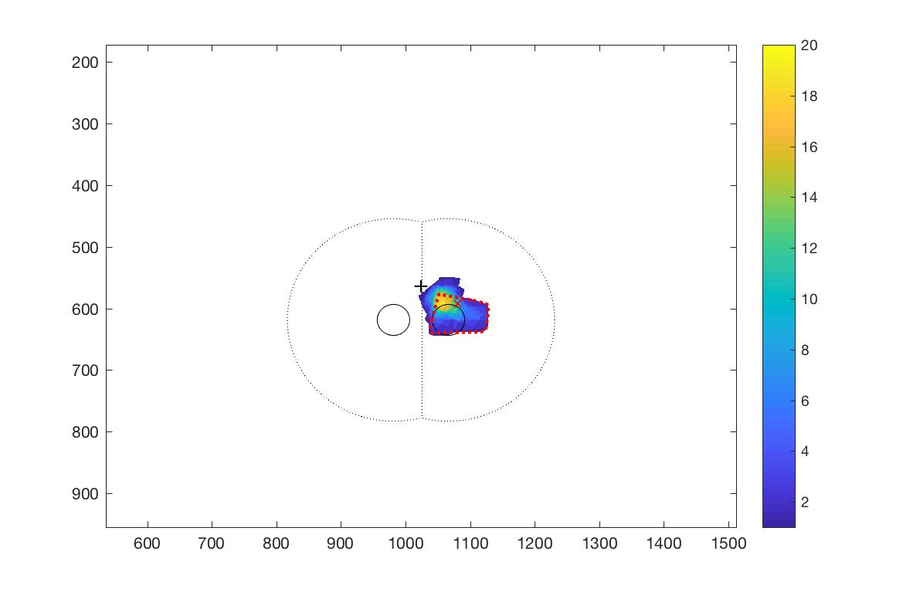
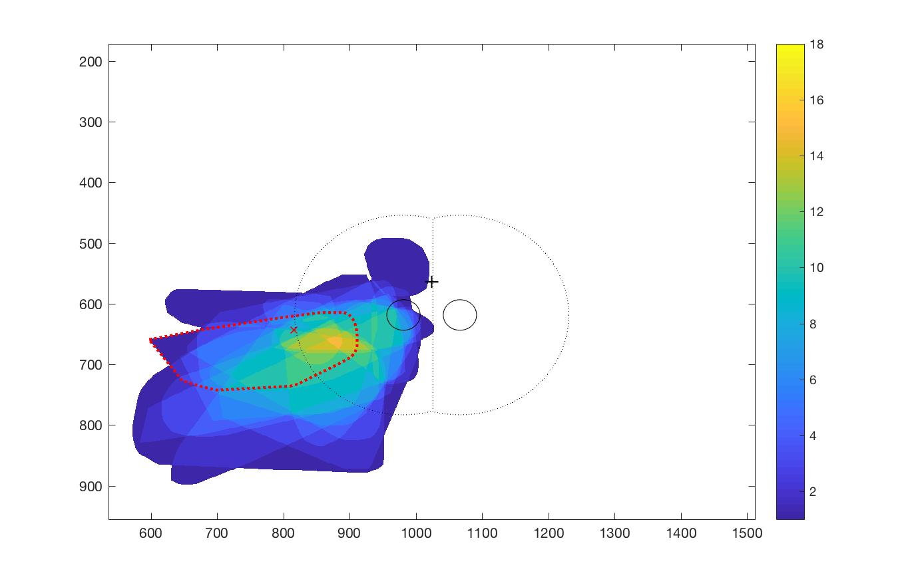

[![CC BY 4.0][cc-by-shield]][cc-by]  
# phospheneLocalizer
A set of Matlab fuctions for the interactive visual field mapping of phosphenes triggered by transcranial magentic stimulation (TMS), using a regular computer monitor and mouse.

## Instructions
The following 3 functions can be run:

### phospheneSearch.m
The most interactive routine.

Allows participants to respond yes/no/maybe with mouse clicks that produce distinctive audio signals to communicate phosphene perception to the experimenter.

Clicking yes triggers a subroutine (getPhosDrawing.m, getPhosDrawing_X.m or getPhosDrawing2.m, can't remember) allowing participants to draw the outline of the phophene they just perceived and indicate a single point (center, center of mass, brigthesst point, etc., per instruction from the experimenter).

Each drawing is displayed to the experimenter on a second monitor, with subsequent drawing displayed on top.

Other experimenter actions are indicated in between drawings, e.g. to clear phosphenes displayed to the experimenter.

### phospheneThresh.m
Implementation of a phosphene threshold estimation routine, where threshold is defined as the lowest TMS intensity producing at least Y phosphenes over a fixed number N of TMS single pulses (e.g. Y/N = 4/6).

The experimenter applies single pulses of TMS at a fixed high intensity.

Participants click yes/no (maybe responses are not allowed) to communicate their perception through audio signals as in phospheneSearch.m.  
Additional audio signals indicate to
- lower TMS intensity by a fixed step size defined by the experimenter (when y=Y, where y is the current number of phosphene perceived or
- stop (when N-y>N-Y, i.e. that the treshold was passed).

The estimated phosphene threshold then correspond to the TMS intensity at the stop signal plus the TMS intensity step size.

### phospheneDrawing.m
A more rigid routine to collect phosphene drawings for a fixed number of TMS pulse and a fixed TMS intensity (if participants fail to perceive a phosphene after a pulse, it is recorded as a null phosphene).

### Visual Dispay Set-up and Other Parameters

Compatibility with the monitor used can be finicky, and issues are mostly handled in initiatePTB.m. For example, to control both the participant's visual environemnt and the experimenter's visual feedback from the same computer, dual display is used in extended desktop mode. You should make sure that the external screen is to the right of the main screen, with its upper limit flush with the main screen’s upper limit. In doubt, input screen resolutions manually in initiatePTB.m

The phosphene drawing field-of-view also needs to be adjusted to your particular monitor in setParam.m.

Elements displayed in the phosphene drawing field-of-view are controled in initiateStimParam.m, where the experimenter can for example adjust the brightness of the central cross for it to be just perceptible. Note that it also initiates other elements that are displayed only to the experimenter (through initiatePsychoStimParam.m), which are not necessary for mapping phosphenes but can be helpful to e.g. outline a region of the visual field that an experimenter might want to target.

### Outputs
Sample of completed phosphene maps as seen on the experimenter's monitor. Only the last phosphene is outlined (in red). Heat maps combining all phosphenes are recomputed after each new phosphene.  

### Compatibility
Developped on Mac and PC, extensively used on a single Mac laptop and monitor.

## License
[![CC BY 4.0][cc-by-image]][cc-by]  
This work is licensed under a  
Creative Commons Attribution 4.0 International License ([CC BY 4.0][cc-by])  
by Sébastien Proulx  
sebastien.prouxl2@mail.mcgill.ca  
https://orcid.org/0000-0003-1709-3277  

[cc-by]: http://creativecommons.org/licenses/by/4.0/
[cc-by-image]: https://i.creativecommons.org/l/by/4.0/88x31.png
[cc-by-shield]: https://img.shields.io/badge/License-CC%20BY%204.0-lightgrey.svg
